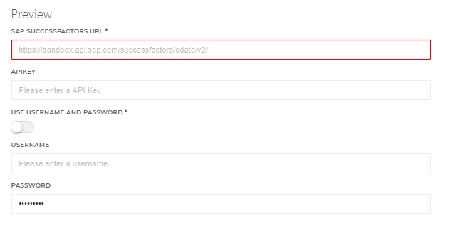

### Note!  This connector is a work in progress

## Table of contents

- [Table of contents](###Table-of-contents)
- [ToDo](###ToDo)
- [Getting started](#Getting-started)
  + [Prerequisites](####Prerequisites)
  + [Setup the PowerShell connector](#Setup-the-PowerShell-connector)
  + [Endpoints implemented](#Endpoints-implemented)
  
### ToDo
 - [ ] Rate limiting API Calls ? https://blogs.sap.com/2017/08/11/sap-api-management-rate-limiting-api-calls-per-application/
 - [ ] Mutex ??
---
## Getting started

By using this connector you will have the ability to update identities from the SAP SuccessFactors system. Since we won't create employees with a target connector the create action is just an update. Also, because of this, there is only one action with can be used for the create and the update. And there are no enable, disable and delete ations.

### Prerequisites

- [ ] Verify in which customString field in the api the UserPrincipalName is saved. This is needed to update the correct field
- [ ] Make sure SAP-SuccessFactors is added as source connector, and verify if the PersonExternalID is mapped in the Person object, this ID is used to update the identity in SAP-SF
- [ ] UserName and password or an API key to authenticate with the SAP-SuccessFactors Webservice

### Setup the PowerShell connector

1. Add a new 'Target System' to HelloID and make sure to import all the necessary files.
_The create.ps1 file can be used in the create and update actions_

    - [ ] config.json
    - [ ] create.ps1 

2. Fill in the required fields on the 'Configuration' tab.

3. Add by _"Use account data form system"_ for example _"Active Directory"_ as. To get the UserPrincipalName or the Email Adress, in the task.

 

_For more information about our HelloID PowerShell connectors, please refer to our general [Documentation](https://docs.helloid.com/hc/en-us/articles/360012558020-How-to-configure-a-custom-PowerShell-target-connector) page_

---

##### Endpoints implemented

- /PerPersonal *Personal Information*
- /PerEmail
- /upsert  *Update Information*
- /Picklist('ecEmailType')

# HelloID Docs
The official HelloID documentation can be found at: https://docs.helloid.com/
